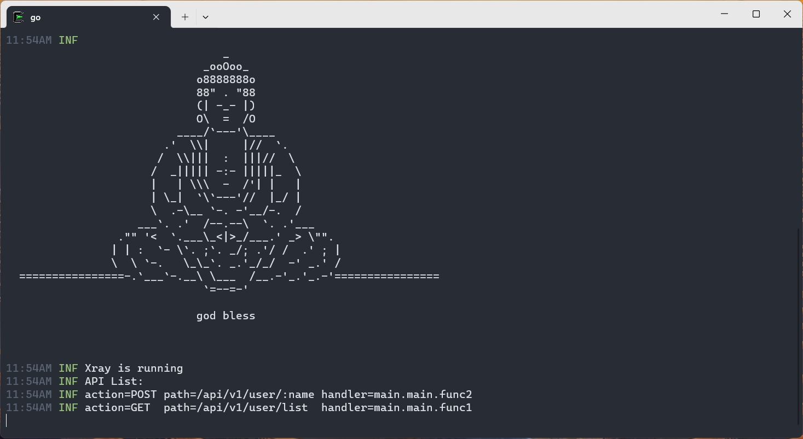
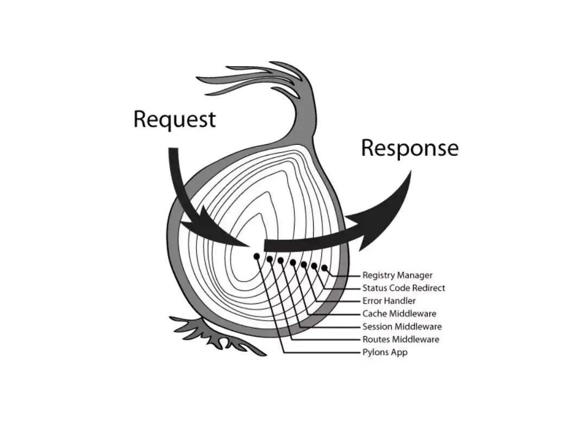

# uRouter

universal router for http, websocket and custom protocol, one is all.

Hats off to express, koa, gin!

[![Build Status][1]][2] [![MIT licensed][3]][4] [![Go Version][5]][6] [![codecov][7]][8] [![Go Report Card][9]][10]

[1]: https://github.com/lxzan/uRouter/workflows/Go%20Test/badge.svg?branch=main

[2]: https://github.com/lxzan/uRouter/actions?query=branch%3Amain

[3]: https://img.shields.io/badge/license-MIT-blue.svg

[4]: LICENSE

[5]: https://img.shields.io/badge/go-%3E%3D1.16-30dff3?style=flat-square&logo=go

[6]: https://github.com/lxzan/uRouter

[7]: https://codecov.io/gh/lxzan/uRouter/branch/main/graph/badge.svg?token=0Tx9xH9Lvd

[8]: https://codecov.io/gh/lxzan/uRouter

[9]: https://goreportcard.com/badge/github.com/lxzan/uRouter

[10]: https://goreportcard.com/report/github.com/lxzan/uRouter

#### Feature

- amazing 100% branch coverage for unit tests
- no dependence
- dynamic separation matching request paths, powered by map and trie
- the onion model middleware, router group
- adapt to `http`, `http2`, `http3`, `fasthttp`, `lxzan/gws`, `gorilla/websocket` ...

#### Index

- [uRouter](#urouter)
    - [Feature](#feature)
    - [Quick Start](#quick-start)
    - [WebSocket](#websocket)
        - [Server](#server)
        - [Client](#client)
    - [Route](#route)
        - [Static](#static)
        - [Dynamic](#dynamic)
    - [Middleware](#middleware)
    - [Codec](#codec)
        - [WWW Form Codec](#www-form-codec)
        - [JSON Codec](#json-codec)
        - [Header Codec (Not applicable to HTTP)](#header-codec-not-applicable-to-http)
    - [Swagger](#swagger)
    - [Benchmark](#benchmark)
        - [RPS](#rps)
        - [Route Algorithm](#route-algorithm)
    - [Acknowledgements](#acknowledgements)

#### Quick Start

```go
package main

import (
    "github.com/lxzan/uRouter"
    httpAdapter "github.com/lxzan/uRouter/contrib/adapter/http"
    "github.com/lxzan/uRouter/contrib/codec/jsoniter"
    "github.com/lxzan/uRouter/contrib/log/zerolog"
    "net/http"
)

func init() {
    uRouter.SetJsonCodec(jsoniter.JsoniterCodec)
    uRouter.SetLogger(zerolog.ZeroLogger)
}

func main() {
    var router = uRouter.New()
    router.Use(uRouter.Recovery(), uRouter.AccessLog())
    var group = router.Group("/api/v1")

    group.OnGET("/user/list", func(ctx *uRouter.Context) {
        _ = ctx.WriteJSON(http.StatusOK, []string{"ming", "hong"})
    })

    group.OnPOST("/user/:name", func(ctx *uRouter.Context) {
        _ = ctx.WriteJSON(http.StatusOK, uRouter.Any{
            "hello": ctx.Param("name"),
        })
    })

    router.Start()
    if err := http.ListenAndServe(":3000", httpAdapter.NewAdapter(router)); err != nil {
        uRouter.Logger().Panic(err.Error())
    }
}
```

- Output



#### WebSocket

##### Server

```go
package main

import (
    "github.com/lxzan/gws"
    "github.com/lxzan/uRouter"
    gwsAdapter "github.com/lxzan/uRouter/contrib/adapter/gws"
    httpAdapter "github.com/lxzan/uRouter/contrib/adapter/http"
    "github.com/lxzan/uRouter/contrib/codec/jsoniter"
    "github.com/lxzan/uRouter/contrib/log/zerolog"
    "net/http"
)

func init() {
    uRouter.SetLogger(zerolog.ZeroLogger)
    uRouter.SetJsonCodec(jsoniter.JsoniterCodec)
}

func main() {
    router := uRouter.New()
    router.Use(uRouter.Recovery(), uRouter.AccessLog())

    upgrader := gws.NewUpgrader(func(c *gws.Upgrader) {
        c.EventHandler = &WebSocketHandler{adapter: gwsAdapter.NewAdapter(router)}
    })

    router.OnGET("/connect", func(ctx *uRouter.Context) {
        socket, err := upgrader.Accept(ctx.Writer.Raw().(http.ResponseWriter), ctx.Request.Raw.(*http.Request))
        if err != nil {
            uRouter.Logger().Error(err.Error())
            return
        }
        go socket.Listen()
    })

    router.On("/greet", func(ctx *uRouter.Context) {
        ctx.Writer.Header().Set("content-type", "plain/text")
        _ = ctx.WriteString(int(gws.OpcodeText), "hello!")
    })

    router.Start()
    if err := http.ListenAndServe(":3000", httpAdapter.NewAdapter(router)); err != nil {
        uRouter.Logger().Panic(err.Error())
    }
}

type WebSocketHandler struct {
    gws.BuiltinEventEngine
    adapter *gwsAdapter.Adapter
}

func (c *WebSocketHandler) OnMessage(socket *gws.Conn, message *gws.Message) {
    if err := c.adapter.ServeWebSocket(socket, message); err != nil {
        uRouter.Logger().Error(err.Error())
    }
}

```

##### Client

```js
let ws = new WebSocket('ws://127.0.0.1:3000/connect');
ws.send('0033{"U-Path":"/greet","U-Action":""}{"hello":"world!"}');
```

#### Route

##### Static

```go
router.OnGET("/ping", func (ctx *uRouter.Context) {})
```

##### Dynamic

```go
router.OnPOST("/user/:id", func (ctx *uRouter.Context) {})
```

#### Middleware



```go
package main

import (
    "fmt"
    "github.com/lxzan/uRouter"
    http2 "github.com/lxzan/uRouter/contrib/adapter/http"
    "net/http"
)

func main() {
    var router = uRouter.New()

    var list []int
    router.Use(func(ctx *uRouter.Context) {
        list = append(list, 1)
        ctx.Next()
        list = append(list, 2)
        fmt.Printf("%v\n", list)
    })

    var group = router.Group("/api/v1", func(ctx *uRouter.Context) {
        list = append(list, 3)
        ctx.Next()
        list = append(list, 4)
    })

    group.OnGET("/greet", func(ctx *uRouter.Context) {
        list = append(list, 5)
    })

    router.Start()
    _ = http.ListenAndServe(":3000", http2.NewAdapter(router))
}
```

```
output: 1, 3, 5, 4, 2
```

#### Codec

##### WWW Form Codec

```go
type Input struct {
Name string `form:"name"`
Age  int    `form:"age"`
}

func (c *Controller) Test(ctx *uRouter.Context) {
defer ctx.Request.Close()
var input = &Input{}
_ = wwwform.FormCodec.NewDecoder(ctx.Request.Body).Decode(input)

fmt.Printf("%v\n", input)
_ = ctx.WriteString(http.StatusOK, "success")
}
```

##### JSON Codec

```go
import (
"github.com/lxzan/uRouter"
"github.com/lxzan/uRouter/contrib/codec/jsoniter"
)

func init() {
// Better performance than uRouter.StdJsonCodec 
uRouter.SetJsonCodec(jsoniter.JsoniterCodec)
}

type Input struct {
Name string `form:"name"`
Age  int    `form:"age"`
}

func (c *Controller) Test(ctx *uRouter.Context) {
defer ctx.Request.Close()
var input = &Input{}
_ = uRouter.JsonCodec().NewDecoder(ctx.Request.Body).Decode(input)

fmt.Printf("%v\n", input)
_ = ctx.WriteString(http.StatusOK, "success")
}
```

##### Header Codec (Not applicable to HTTP)

```
uRouter.TextMapHeader:   length_encoding=4 byte, max_header_length=9999  byte
uRouter.BinaryMapHeader: length_encoding=2 byte, max_header_length=65535 byte
```

```
// TextMapHeader Example
// header length => header payload => body
0033{"U-Path":"/greet","U-Action":""}{"hello":"world!"}
```

#### Swagger

1. install command tool

```bash
go install github.com/swaggo/swag/cmd/swag@latest
```

2. generate docs

```bash
swag init
```

3. write your code

```go
package main

import (
    "github.com/lxzan/uRouter"
    httpAdapter "github.com/lxzan/uRouter/contrib/adapter/http"
    "github.com/lxzan/uRouter/contrib/doc/swagger"
    _ "github.com/lxzan/uRouter/examples/debug/docs"
    swaggerFiles "github.com/swaggo/files"
    "net/http"
)

// PingExample godoc
// @Summary ping example
// @Schemes
// @Description do ping
// @Tags example
// @Accept json
// @Produce json
// @Success 200 {string} Helloworld
// @Router /example/helloworld [get]
func Helloworld(ctx *uRouter.Context) {
    _ = ctx.WriteJSON(http.StatusOK, "helloworld")
}

func main() {
    var router = uRouter.New()
    router.Use(uRouter.Recovery(), uRouter.AccessLog())

    router.OnGET("/swagger/:any", swagger.WrapHandler(swaggerFiles.Handler))

    router.OnGET("/api/v1/example/helloworld", Helloworld)

    router.Start()

    if err := http.ListenAndServe(":3000", httpAdapter.NewAdapter(router)); err != nil {
        uRouter.Logger().Panic(err.Error())
    }
}
```

#### Benchmark

##### RPS

- `uRouter / Standard`

```
wrk -t4 -c100 -d10s http://127.0.0.1:3000/test
Running 10s test @ http://127.0.0.1:3000/test
  4 threads and 100 connections
  Thread Stats   Avg      Stdev     Max   +/- Stdev
    Latency   842.21us    1.16ms  16.97ms   86.80%
    Req/Sec    50.92k     8.35k   74.41k    71.00%
  2029109 requests in 10.03s, 230.28MB read
Requests/sec: 202250.69
Transfer/sec:     22.95MB
```

- `uRouter / FastHTTP`

```
wrk -t4 -c100 -d10s http://127.0.0.1:3000/test
Running 10s test @ http://127.0.0.1:3000/test
  4 threads and 100 connections
  Thread Stats   Avg      Stdev     Max   +/- Stdev
    Latency   770.07us    1.76ms  24.38ms   92.02%
    Req/Sec    87.59k    17.29k  132.58k    64.25%
  3495445 requests in 10.06s, 463.36MB read
Requests/sec: 347469.03
Transfer/sec:     46.06MB
```

- `Standard`

```
wrk -t4 -c100 -d10s http://127.0.0.1:3002/test
Running 10s test @ http://127.0.0.1:3002/test
  4 threads and 100 connections
  Thread Stats   Avg      Stdev     Max   +/- Stdev
    Latency   824.42us    1.20ms  24.56ms   87.58%
    Req/Sec    54.28k     9.66k   84.70k    69.75%
  2163902 requests in 10.05s, 249.70MB read
Requests/sec: 215292.62
Transfer/sec:     24.84MB
```

- `FastHTTP`

```
wrk -t4 -c100 -d10s http://127.0.0.1:3001/test
Running 10s test @ http://127.0.0.1:3001/test
  4 threads and 100 connections
  Thread Stats   Avg      Stdev     Max   +/- Stdev
    Latency   682.07us    1.85ms  34.71ms   93.02%
    Req/Sec   103.69k    22.77k  175.90k    64.39%
  4096885 requests in 10.07s, 543.09MB read
Requests/sec: 406843.81
Transfer/sec:     53.93MB
```

##### Route Algorithm

- `uRouter`

```
goos: darwin
goarch: arm64
pkg: github.com/lxzan/uRouter
BenchmarkOneRoute-8             	77647704	        13.53 ns/op	       0 B/op	       0 allocs/op
BenchmarkOneRouteDynamic-8      	34728837	        34.69 ns/op	       0 B/op	       0 allocs/op
BenchmarkRecoveryMiddleware-8   	70822222	        16.99 ns/op	       0 B/op	       0 allocs/op
Benchmark5Params-8              	15952770	        73.23 ns/op	       0 B/op	       0 allocs/op
BenchmarkOneRouteJSON-8         	89840808	        13.39 ns/op	       0 B/op	       0 allocs/op
Benchmark404-8                  	81540667	        14.89 ns/op	       0 B/op	       0 allocs/op
Benchmark404Many-8              	35411809	        34.11 ns/op	       0 B/op	       0 allocs/op
PASS
```

```
goos: darwin
goarch: arm64
pkg: github.com/gin-gonic/gin
BenchmarkOneRoute-8             	45460980	        26.13 ns/op	       0 B/op	       0 allocs/op
BenchmarkRecoveryMiddleware-8   	38337534	        31.00 ns/op	       0 B/op	       0 allocs/op
Benchmark5Params-8              	18889320	        63.42 ns/op	       0 B/op	       0 allocs/op
BenchmarkOneRouteJSON-8         	 7542141	       162.7 ns/op	      48 B/op	       3 allocs/op
Benchmark404-8                  	29467527	        43.23 ns/op	       0 B/op	       0 allocs/op
Benchmark404Many-8              	27458932	        43.92 ns/op	       0 B/op	       0 allocs/op
PASS
```

#### Acknowledgements

- [gin-swagger](https://github.com/swaggo/gin-swagger)
